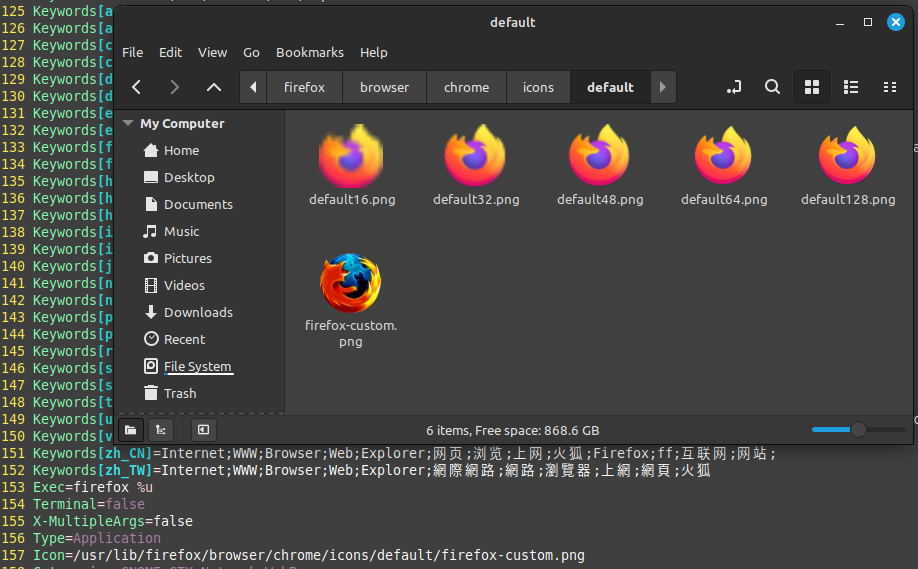

# Firefox configuration
Firefox is an open-source browser that allows easy custom configuration with a `user.js` file.

# Installation/usage

-> Download the `user.js` script in this (or a different) repository.

-> In Firefox, visit `about:support` and press `Open Directory` in the `Profile Directory` section.

-> Add the `user.js` file to this directory.

-> Restart Firefox.

# Objectives

This user.js script is designed to be **simple** and **compatible**.

1. All `telemetry` is disabled, including default telemetry, crash reports, and studies.

-> Telemetry is data collection/tracking that sends data to Mozilla servers.

2. `Pocket` disabled.

-> Pocket is the default browser extension to store articles between devices, but it contains sponsored messages.

3. Increased default refresh rate and smoother scrolling to enhance user experience.

Unlike some other Firefox "hardening" javascript files, this does not impact cookies or fingerprinting or other services that make some websites incompatible.

# Changing Firefox desktop icon on Linux

1. Download the custom desktop icon in `images/` or use another image.

2. Copy or move the photo into `/usr/lib/firefox/browser/chrome/icons/default`

-> This can be done by opening file explorer to the directory (folder) that contains the image you want to move.

-> Then right click and select open in `open in terminal`

-> `cp <image_file.png/jpg> /usr/lib/firefox/browser/chrome/icons/default` 


3. Use a text editor to update the path to the new image.

->`vim /usr/share/applications/firefox.desktop`

-> Find the line that says `Icon=...`



4. Change the file name at the end of the path to the file name of the new file. After step 2, the image should now be in the directory as the default icon path.

5. Restart your computers environment. In `Linux Mint`, this is `Alt + F2` and then entering `r`.

-> You can also simply restart your computer.

# Changing Firefox background on Linux

1. Download the firefox background in `images/` or use another image.

2. Move the image to `~/.mozilla/firefox/enfpmt5x.default-release/chrome`

-> note that `.mozilla` is a hidden folder, so this can be done in a terminal or by enabling hidden files and folders in file explorer. This can be done with `CTRL + h` or by checking with your operating system's settings.

3. `vim ~/.mozilla/firefox/enfpmt5x.default-release/chrome/userContent.css`

4. In vim (or another text editor), make the file look like this:

```
@-moz-document url(about:home), url(about:newtab), url(about:privatebrowsing) {
    .click-target-container *, .top-sites-list * {
        color: #fff !important ;
        text-shadow: 2px 2px 2px #222 !important ;
    }

    body::before {
        content: "" ;
        z-index: -1 ;
        position: fixed ;
        top: 0 ;
        left: 0 ;
        background: #f9a no-repeat url(<IMAGE_FILE_NAME.png/jpg>) center ;
        background-size: cover ;
        width: 100vw ;
        height: 100vh ;
    }
}
```

The background provided in `images/` goes together very well with this Firefox theme:

`https://addons.mozilla.org/en-US/firefox/addon/blue-nebula-space-theme/`
